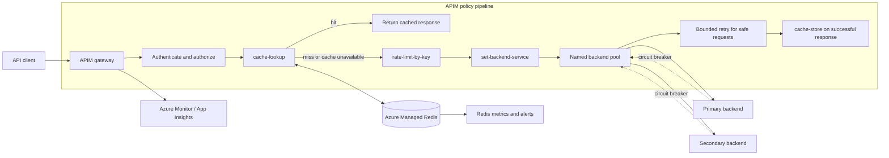

# Azure API Management Cache-Aside Routing

## Executive Summary

Azure API Management (APIM) can implement cache-aside routing with its response-cache policies (`cache-lookup` and `cache-store`), arbitrary key-value cache policies, named backend entities, backend pools, circuit breakers, and conditional routing policies. Cache availability is deliberately best effort: an unavailable configured cache produces a miss and the request normally continues to the backend, so backend protection is part of the cache design rather than an optional add-on.[^1]

For a production, shared, or multi-region cache, use Azure Managed Redis as APIM's external cache. Do not treat `caching-type="prefer-external"` as runtime failover to the internal cache: it selects the internal cache only when no external cache is configured. If the configured external cache is unavailable, APIM falls through to the backend.[^1][^2]

APIM has no documented same-key request-coalescing or cache-stampede lock. Microsoft's explicit mitigation is to put `rate-limit` or `rate-limit-by-key` immediately after a cache lookup. Backend pools and circuit breakers add routing resilience, but their state is approximate because gateway instances do not synchronize their load-balancer and breaker state.[^3][^4]

For this repository, the recommended delivery stack is Bicep for the APIM platform and Azure Managed Redis, plus an APIOps content-promotion workflow for APIs and policies. The original `Azure/apiops` project is transitioning toward `Azure/apiops-cli`, so validate the successor against repository requirements before standardizing on it.[^5][^6]

## Research Scope

This report covers:

- APIM caching and backend-routing policies
- Cache limitations and failure semantics
- Concurrency, stale-data, and retry risks
- Observability and alerting
- Currently supported testing approaches
- Bicep, Terraform/AzAPI, and APIOps options

Only Microsoft documentation and official Microsoft/Azure GitHub repositories were used.

## Recommended Architecture



### Request flow

1. Authenticate before any private cache lookup. Do not cache sensitive or personal responses unless isolation and key design have been explicitly proven safe.[^7]
2. For complete GET responses, use `cache-lookup` in `inbound`. Vary the key by every request property that can change the representation, commonly selected query parameters and `Accept` headers.[^8]
3. On a cache hit, APIM returns the cached response without calling the backend.
4. Place `rate-limit` or `rate-limit-by-key` immediately after the lookup. Because the remainder of the inbound pipeline runs on a miss, this bounds backend traffic during cold starts and cache outages.[^3]
5. Select a named backend or pool with `set-backend-service backend-id="..."`. Named backends are preferable to raw URLs because they can carry credentials, TLS settings, load balancing, and circuit-breaker configuration.[^4][^9]
6. Use retries only for idempotent operations and transient failures. Keep attempts and time budgets small; retries multiply backend load during an outage.[^10]
7. Store only successful, cacheable GET responses. `cache-store` caches only `200 OK` by default; enabling `cache-response="true"` broadens this and should be an explicit decision.[^11]
8. Invalidate affected key-value entries after successful writes when using `cache-lookup-value`/`cache-store-value`. APIM does not automatically keep arbitrary cached values consistent with backend writes.[^12]

## Caching Capabilities

| Policy | Purpose | Section | Important behavior |
|---|---|---|---|
| `cache-lookup` | Complete HTTP response lookup | `inbound` | GET only; one per section; not supported in policy fragments |
| `cache-store` | Complete HTTP response storage | `outbound` | GET only; `200 OK` only by default |
| `cache-lookup-value` | Arbitrary key-value lookup | Any pipeline section | Variable is absent on a miss unless a default is supplied |
| `cache-store-value` | Arbitrary key-value storage | Any pipeline section | Write is asynchronous and might not be immediately readable |
| `cache-remove-value` | Explicit key invalidation | Any pipeline section | Removal errors are ignored by default |

The complete-response pair is the simplest and most observable option when the cached unit is an HTTP GET response. Use key-value policies when the gateway needs to cache a fragment, lookup result, routing datum, or a representation requiring a custom key.[^8][^11][^12][^13]

### Cache selection

`caching-type` supports:

- `internal`: force APIM's built-in cache.
- `external`: require the configured Redis-compatible cache.
- `prefer-external`: use an external cache when one is configured; otherwise use the built-in cache.[^8]

`prefer-external` is not an active-active or runtime failover strategy. If an external cache is configured but unavailable, APIM treats the operation as a miss and normally continues to the backend.[^1][^2]

### Tier and topology constraints

| Environment | Cache behavior |
|---|---|
| Classic Developer/Basic/Standard/Premium | Internal cache is volatile and does not persist through service updates |
| Basic v2/Standard v2/Premium v2 | Internal cache has persistent storage |
| Consumption | No internal cache; external cache required |
| Self-hosted gateway | No internal cache; external cache required |
| Multi-region APIM | Each region has an independent internal cache |
| Workspaces | External cache is currently unavailable |

The internal cache is shared by APIM units within a region. A multi-region deployment does not synchronize internal cache entries between regions.[^2][^14]

### External cache recommendation

Use Azure Managed Redis when the design needs:

- a shared cache across APIM instances or regions;
- greater capacity and cache-control visibility;
- caching on Consumption or self-hosted gateways;
- cache continuity independent of classic-tier APIM service updates.[^2]

APIM currently connects to Azure Managed Redis with a Redis connection string and access-key authentication; Microsoft Entra authentication is not currently supported for this APIM integration.[^2] Azure Cache for Redis is on a retirement path, so new deployments should target Azure Managed Redis rather than introduce a legacy dependency.[^15]

## Cache Key and Data Rules

A safe cache key must include every dimension that changes the response:

```text
<api-version>:<operation>:<tenant-or-public-scope>:<canonical-path>:<selected-query>:<representation>
```

For `cache-lookup`, express these dimensions through `vary-by-query-parameter`, `vary-by-header`, `vary-by-developer`, and `vary-by-developer-groups`. Avoid including secrets or personal data in keys because keys can surface in diagnostics.[^7][^8]

Authenticated responses are not privately cached by default. If `allow-private-response-caching="true"` is used, the authorization identity must participate in cache variation; otherwise a shared entry can cross security boundaries. The safer default is to avoid gateway caching for user-specific or sensitive responses.[^7][^8]

TTL should follow the data's tolerated staleness and update frequency. Short TTLs can create repeated backend fetches; long TTLs increase stale-data and eviction risk. Where appropriate, derive TTL from an approved backend `Cache-Control: max-age` value and apply a bounded default.[^16]

## Failure Behavior and Risk Controls

### Cache outages

APIM cache access is best effort. A failed read returns no cached value rather than an API error, and execution should fall back to the backend. This preserves availability but can immediately transfer the full request rate to the origin.[^1]

Required controls:

- rate-limit immediately after lookup;
- capacity and saturation alerts on every backend;
- Redis availability, latency, memory, connection, and eviction alerts;
- a deliberate degraded-mode response when the backend cannot absorb uncached load.

### Cache stampede and concurrency

APIM has no documented mechanism that combines concurrent misses for the same key into one backend request. `cache-store-value` is asynchronous, which extends the interval in which subsequent requests can miss after a store is initiated.[^13]

`limit-concurrency` is not a true distributed stampede lock:

- it encloses policies only inside one pipeline section;
- it cannot span an inbound cache lookup and a backend-section `forward-request`;
- exceeding the limit fails requests immediately with `429`, rather than queueing them;
- enforcement is approximate in a distributed, scaled gateway.[^17]

Use rate limiting as the documented baseline. If strict same-key coalescing is required, implement it in a backend or cache-aware service that owns a distributed lock; do not infer that APIM policies provide this guarantee.

### Staleness and invalidation

Cache-aside does not guarantee consistency. A backend update is not visible until the cached entry expires or is invalidated. For key-value caching, successful mutation operations should remove the affected key with `cache-remove-value`; the next read repopulates it.[^12][^16]

Invalidation itself can fail. Decide whether removal failure should:

- remain best effort, favoring availability but allowing stale data; or
- fail the mutation response, favoring stronger consistency.

The `fail-on-cache-removal-error` setting controls that policy decision and defaults to `false`.[^12]

### Backend routing and failover

Backend pools support round-robin, weighted, and priority-based distribution. Priority groups route to lower-priority backends only when all higher-priority members are unavailable because their breakers are tripped. Pools support up to 30 backends.[^4]

Circuit-breaker caveats:

- one breaker rule per backend;
- breaker state is approximate and local to gateway instances;
- circuit breaker is unavailable in the Consumption tier;
- a tripped backend returns `503` when addressed directly, while a pool can route to an available member.[^4]

Retries can switch backends and support fixed, linear, or exponential intervals. The retry block executes its child policies once before evaluating whether a retry is needed. Use this only for replay-safe requests, and avoid combining large retry counts with cache-outage traffic.[^10]

### Policy inheritance

If a parent policy uses `set-backend-service backend-id="..."`, a child scope can override it only with another `backend-id`, not a raw `base-url`. Standardize on named backend entities across policy scopes to avoid this inheritance trap.[^9]

## Baseline Policy Pattern

This response-caching pattern follows the documented execution model and deliberately does not claim request coalescing:

```xml
<policies>
  <inbound>
    <base />

    <!-- Authentication and authorization policies go before private caching. -->

    <cache-lookup
      vary-by-developer="false"
      vary-by-developer-groups="false"
      caching-type="external"
      downstream-caching-type="none"
      must-revalidate="true">
      <vary-by-header>Accept</vary-by-header>
      <vary-by-query-parameter>version</vary-by-query-parameter>
    </cache-lookup>

    <!-- Runs on a miss and protects the backend during cache failure. -->
    <rate-limit-by-key
      calls="100"
      renewal-period="60"
      counter-key="@(context.Api.Id + &quot;:&quot; + context.Subscription?.Id)" />

    <set-backend-service backend-id="read-backend-pool" />
  </inbound>

  <backend>
    <retry
      condition="@(context.Response != null &&
                   (context.Response.StatusCode == 429 ||
                    context.Response.StatusCode >= 500))"
      count="1"
      interval="1"
      first-fast-retry="false">
      <forward-request />
    </retry>
  </backend>

  <outbound>
    <base />
    <choose>
      <when condition="@(context.Response.StatusCode == 200)">
        <cache-store duration="300" />
      </when>
    </choose>
  </outbound>

  <on-error>
    <base />
  </on-error>
</policies>
```

Values such as TTL, rate limits, retry count, and the cache isolation dimensions are workload decisions and require load and failure testing.

## Observability

### Native signals

APIM exposes request, gateway duration, backend duration, capacity/CPU, and memory metrics, but it has no dedicated cache-hit or cache-miss platform metric.[^18]

`ApiManagementGatewayLogs` contains `Cache` and `CacheTime` columns. Microsoft provides an official KQL example using `Cache == "hit"` and `Cache == "miss"` to calculate hit ratio. The precise `CacheTime` semantics are not documented.[^19][^20]

Microsoft does not document whether `cache-lookup-value` populates those fields. Instrument custom key-value cache branches explicitly rather than assuming the response-cache telemetry applies.[^13][^20]

```kusto
ApiManagementGatewayLogs
| where TimeGenerated > ago(1d)
| summarize
    CacheMisses = countif(Cache == "miss"),
    CacheHits = countif(Cache == "hit")
  by bin(TimeGenerated, 15m), ApiId
| extend HitRatio =
    todouble(CacheHits) / todouble(CacheHits + CacheMisses)
```

### Custom policy telemetry

Use the `trace` policy to record selected routing decisions, cache-key version, hit/miss branch for custom caches, backend logical ID, and retry attempt. Trace records can flow to request traces, Application Insights, and the `TraceRecords` field in gateway logs, subject to diagnostic configuration.[^21]

Use `emit-metric` sparingly for low-cardinality counters in Application Insights. APIM reserves dimensions and enforces time-series limits; excessive cardinality can cause silent metric loss.[^22]

Never log tokens, subscription keys, complete authorization headers, Redis connection strings, or personal cache-key components.

### Operational dashboard

Track:

- cache hit ratio by API and operation;
- request rate and `429` rate after cache lookup;
- gateway duration split by hit/miss;
- backend request rate, latency, `5xx`, and circuit-open behavior;
- APIM capacity or v2 gateway CPU/memory;
- Redis availability, server load, memory, evictions, connections, and latency;
- invalidation failures and stale-data incidents.

Resource logs are unavailable in the Consumption tier. API Inspector request tracing is unavailable in workspaces, although the `trace` policy itself is supported there.[^14][^21][^23]

## Supported Testing Strategy

### 1. Static and deployment checks

- Validate XML and deploy policies through a nonproduction APIM instance.
- Lint OpenAPI definitions and run breaking-change checks in pull requests.
- Deploy infrastructure with Bicep `what-if` or the corresponding Terraform plan.
- Confirm all named backend IDs, cache resources, diagnostics, and named values resolve before behavior tests.

### 2. Gateway behavior tests

Use a real APIM gateway because policy execution, cache behavior, and routing are gateway concerns:

1. Call a cold GET and verify a backend request occurs.
2. Repeat it and verify a cache hit and no backend request.
3. Change each declared vary-by input and verify separation.
4. Verify undeclared query parameters cannot produce incorrect cache reuse.
5. Wait for TTL expiration and verify repopulation.
6. Execute a mutation and verify invalidation.
7. Disable or isolate Redis and verify requests become misses, rate limits engage, and the backend remains healthy.
8. Fail the primary backend and verify breaker/pool behavior.
9. Return `429`, `500`, and timeout responses and verify bounded retry behavior.
10. Test private responses for cross-user and cross-tenant leakage.

### 3. Supported trace paths

The portal Test Console can execute requests and show policy traces. Programmatic tracing uses a time-limited `Apim-Debug-Authorization` token obtained through the APIM management API, followed by retrieval of the trace using its returned trace ID. The old subscription-header tracing model is retired.[^23]

The VS Code APIM policy debugger is currently limited to the Developer tier. It is useful for development, but live integration tests remain the acceptance test because production tiers, networking, identity, Redis, and backend pools can differ.[^24]

### 4. Safe rollout

Use APIM revisions to deploy and test policy changes without immediately changing the current revision. Non-current revisions can be called through the `;rev=N` URL form and can have restrictive access policies during validation.[^25]

Postman collections exported from APIM can support API smoke tests, but only the API definition is exported; policies and subscription keys are not. Keep environment secrets outside the collection and run behavior assertions against the deployed revision.[^26]

## Infrastructure as Code

### Recommended: Bicep

Bicep has first-party resource coverage for the APIM service and child resources, including caches, backends, backend pools, APIs, policies, named values, diagnostics, loggers, revisions, and workspaces. Use stable API version `2024-05-01` where it covers the required feature set.[^27]

Recommended deployment dependency order:

1. Network, identity, Key Vault, monitoring, and Azure Managed Redis
2. APIM service
3. APIM external-cache registration
4. Named backends and backend pools
5. Loggers and diagnostics
6. APIs and revisions
7. Policies

Bicep is the lower-risk default for secrets because it has no persistent state file. Retrieve secrets at deployment time and avoid placing connection strings in source control or outputs.

### Terraform option

Use AzureRM for established APIM features and AzAPI when a required ARM API property is not yet exposed by AzureRM. Both use Terraform state, so secure remote state with encryption and tightly scoped RBAC; mark outputs sensitive and avoid returning cache credentials.[^28]

### Minimal Bicep shape

```bicep
resource apim 'Microsoft.ApiManagement/service@2024-05-01' = {
  name: apimName
  location: location
  identity: {
    type: 'SystemAssigned'
  }
  sku: {
    name: apimSku
    capacity: apimCapacity
  }
  properties: {
    publisherEmail: publisherEmail
    publisherName: publisherName
  }
}

resource primaryBackend 'Microsoft.ApiManagement/service/backends@2024-05-01' = {
  parent: apim
  name: 'primary-read'
  properties: {
    type: 'Single'
    protocol: 'http'
    url: primaryBackendUrl
    tls: {
      validateCertificateChain: true
      validateCertificateName: true
    }
  }
}

resource secondaryBackend 'Microsoft.ApiManagement/service/backends@2024-05-01' = {
  parent: apim
  name: 'secondary-read'
  properties: {
    type: 'Single'
    protocol: 'http'
    url: secondaryBackendUrl
    tls: {
      validateCertificateChain: true
      validateCertificateName: true
    }
  }
}

resource readPool 'Microsoft.ApiManagement/service/backends@2024-05-01' = {
  parent: apim
  name: 'read-backend-pool'
  properties: {
    type: 'Pool'
    pool: {
      services: [
        {
          id: primaryBackend.id
          priority: 1
          weight: 100
        }
        {
          id: secondaryBackend.id
          priority: 2
          weight: 100
        }
      ]
    }
  }
}
```

The external-cache connection string and exact backend circuit-breaker schema should be encapsulated in dedicated modules and verified against the selected API version.

## APIOps Recommendation

Separate two lifecycle concerns:

| Concern | Recommended owner |
|---|---|
| APIM SKU, network, identity, Redis, monitoring, cache registration | Platform IaC |
| OpenAPI definitions, APIs, policies, products, named values, backends | API content promotion |

Microsoft's APIOps guidance uses an extract, review, and publish workflow for promoting APIM content between environments. The original `Azure/apiops` repository does not receive formal APIM product-team support and is transitioning toward `Azure/apiops-cli`; evaluate the successor before committing the repository structure and pipeline contract.[^5][^6]

For a new repository:

1. Keep `infra/` as the source of truth for Bicep modules.
2. Keep API definitions and raw policy XML under a separate artifact tree.
3. Promote policy/API artifacts through pull requests and environment approvals.
4. Pin tool versions in CI.
5. Use workload identity federation for pipelines where supported.
6. Keep environment-specific backend URLs and secret references outside shared policy XML.

## Key Decisions to Resolve Before Implementation

| Decision | Recommended default |
|---|---|
| Cached unit | Complete GET response unless a custom key-value use case is proven necessary |
| Cache service | Azure Managed Redis for production |
| Cache failure mode | Miss and continue, protected by rate limiting |
| Cache key scope | Public only by default; tenant isolation when authenticated |
| TTL | Workload-specific bounded value, initially five minutes only as a hypothesis |
| Invalidation | Explicit invalidation after successful writes |
| Routing | Named backend pool with priority groups and circuit breakers |
| Retry | One bounded retry for idempotent GETs only |
| Telemetry | Gateway resource logs plus App Insights custom traces |
| Platform IaC | Bicep |
| API promotion | Evaluate `Azure/apiops-cli`; retain a simple direct deployment path until validated |

## Confidence Assessment

**High confidence:** Policy availability and sections, GET/status restrictions, cache best-effort behavior, `prefer-external` semantics, asynchronous key-value stores, tier restrictions, backend-pool and circuit-breaker behavior, rate-limit recommendation, native metrics/log fields, and supported tracing mechanisms are directly documented by Microsoft.

**Medium confidence:** The recommended end-to-end architecture combines individually documented APIM capabilities. Exact TTLs, retry budgets, rate limits, pool priorities, and alert thresholds are workload-dependent and must be tested.

**Known documentation gaps:** Microsoft does not document true same-key cache-miss coalescing because APIM has no such documented feature. It also does not define the exact `CacheTime` semantics or confirm whether key-value cache lookups populate the response-cache log fields. The report therefore recommends explicit instrumentation for custom cache paths.

**Time-sensitive findings:** APIOps tooling is in transition, Azure Cache for Redis retirement dates are active, and APIM-to-Azure Managed Redis authentication capabilities can change. Revalidate these points before production rollout.

## Footnotes

[^1]: [Caching overview — cache availability](https://learn.microsoft.com/azure/api-management/caching-overview)
[^2]: [Use an external cache in Azure API Management](https://learn.microsoft.com/azure/api-management/api-management-howto-cache-external)
[^3]: [`cache-lookup` usage notes](https://learn.microsoft.com/azure/api-management/cache-lookup-policy)
[^4]: [Backends in Azure API Management](https://learn.microsoft.com/azure/api-management/backends)
[^5]: [Azure/apiops](https://github.com/Azure/apiops)
[^6]: [Azure/apiops-cli](https://github.com/Azure/apiops-cli)
[^7]: [Cache-Aside pattern](https://learn.microsoft.com/azure/architecture/patterns/cache-aside)
[^8]: [`cache-lookup` policy reference](https://learn.microsoft.com/azure/api-management/cache-lookup-policy)
[^9]: [`set-backend-service` policy reference](https://learn.microsoft.com/azure/api-management/set-backend-service-policy)
[^10]: [`retry` policy reference](https://learn.microsoft.com/azure/api-management/retry-policy)
[^11]: [`cache-store` policy reference](https://learn.microsoft.com/azure/api-management/cache-store-policy)
[^12]: [`cache-remove-value` policy reference](https://learn.microsoft.com/azure/api-management/cache-remove-value-policy)
[^13]: [`cache-store-value` policy reference](https://learn.microsoft.com/azure/api-management/cache-store-value-policy)
[^14]: [API Management feature comparison](https://learn.microsoft.com/azure/api-management/api-management-features)
[^15]: [Azure Cache for Redis retirement FAQ](https://learn.microsoft.com/azure/azure-cache-for-redis/retirement-faq)
[^16]: [Azure caching guidance](https://learn.microsoft.com/azure/architecture/best-practices/caching)
[^17]: [`limit-concurrency` policy reference](https://learn.microsoft.com/azure/api-management/limit-concurrency-policy)
[^18]: [Supported APIM metrics](https://learn.microsoft.com/azure/api-management/monitor-api-management-reference)
[^19]: [`ApiManagementGatewayLogs` table](https://learn.microsoft.com/azure/azure-monitor/reference/tables/apimanagementgatewaylogs)
[^20]: [Official `ApiManagementGatewayLogs` queries](https://learn.microsoft.com/azure/azure-monitor/reference/queries/apimanagementgatewaylogs)
[^21]: [`trace` policy reference](https://learn.microsoft.com/azure/api-management/trace-policy)
[^22]: [`emit-metric` policy reference](https://learn.microsoft.com/azure/api-management/emit-metric-policy)
[^23]: [Trace API calls in Azure API Management](https://learn.microsoft.com/azure/api-management/api-management-howto-api-inspector)
[^24]: [Debug API Management policies in Visual Studio Code](https://learn.microsoft.com/azure/api-management/api-management-debug-policies)
[^25]: [Revisions in Azure API Management](https://learn.microsoft.com/azure/api-management/api-management-revisions)
[^26]: [Export an API to Postman](https://learn.microsoft.com/azure/api-management/export-api-postman)
[^27]: [Bicep and ARM reference for `Microsoft.ApiManagement/service`](https://learn.microsoft.com/azure/templates/microsoft.apimanagement/service)
[^28]: [Azure AzAPI Terraform provider overview](https://learn.microsoft.com/azure/developer/terraform/overview-azapi-provider)
