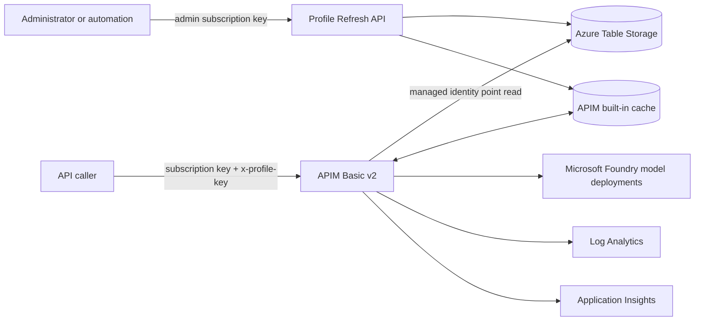
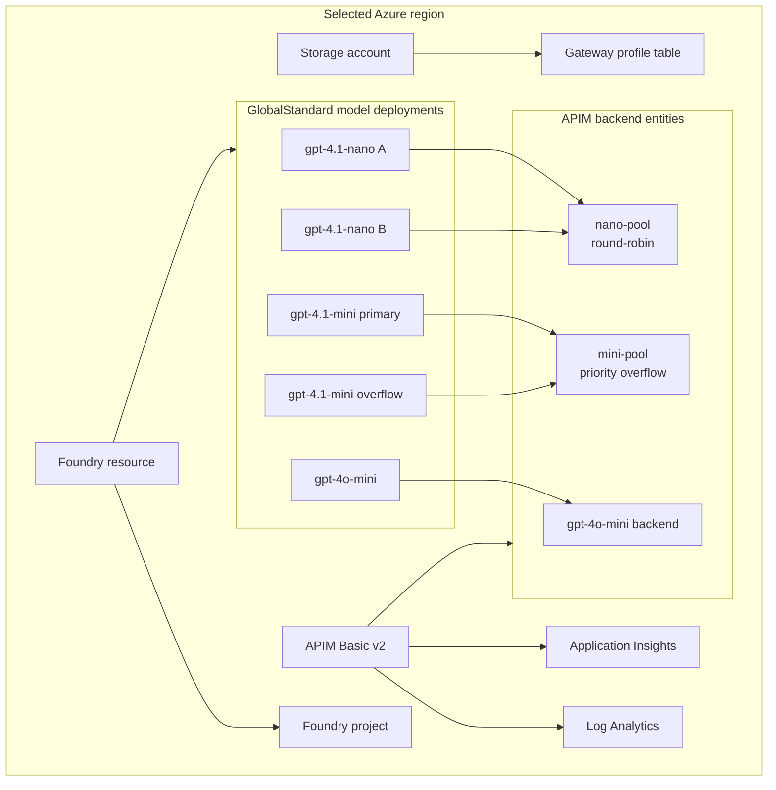
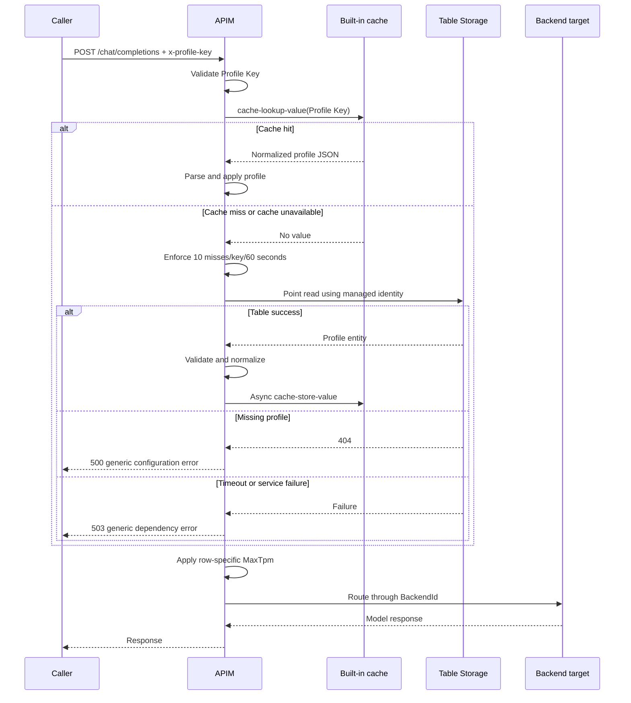
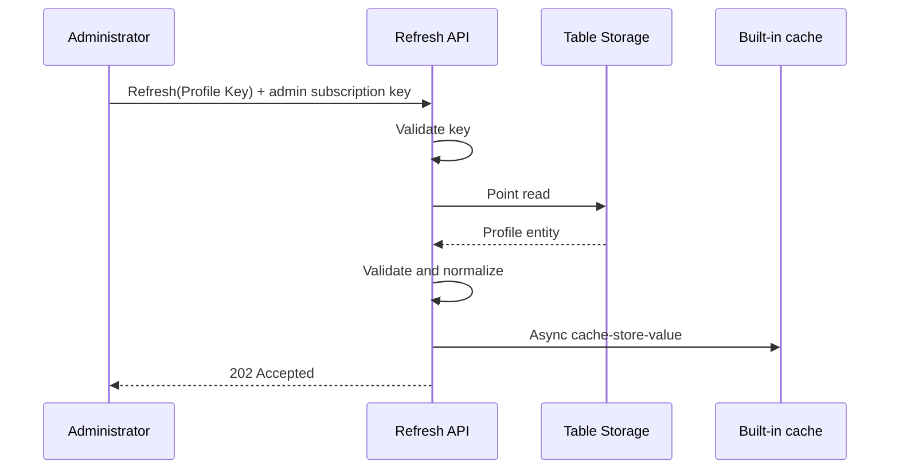
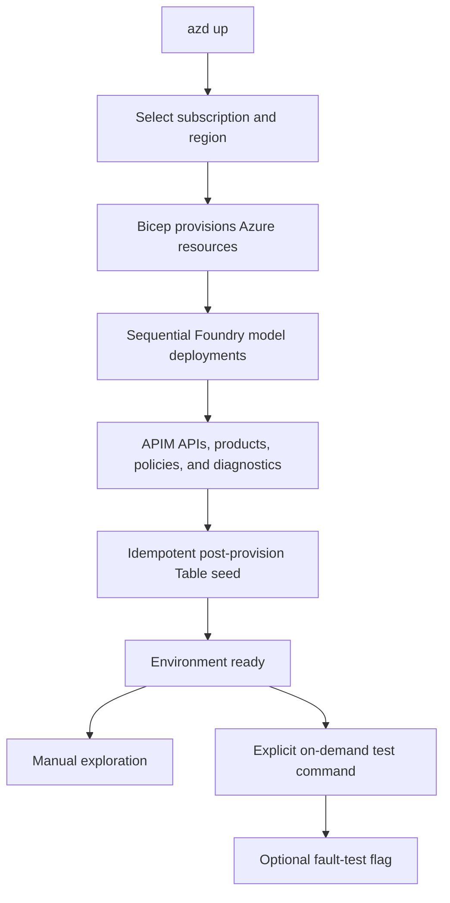

# Gateway Routing Profile Solution Architecture

## Overview

The solution resolves a Gateway Routing Profile for each GenAI request. The profile is stored in Azure Table Storage, cached in APIM's built-in key-value cache, and applied to backend routing and token governance.

The architecture deliberately separates:

- **Profile selection**: upstream policy produces a trusted, normalized Profile Key.
- **Profile resolution**: this solution retrieves, validates, normalizes, and caches the profile.
- **Profile application**: this solution applies each profile's `BackendId` and positive `MaxTpm`.

The sample uses `x-profile-key` only to make the resolution flow directly testable.

## System context



## Azure resource topology



All five model deployments use `GlobalStandard` capacity `1`. This sample exercises APIM routing and policy behavior, not sustained Foundry throughput.

## Identity and access

### APIM identity

APIM uses its system-assigned managed identity by default. An optional user-assigned identity client ID can be configured through a named value.

Required data-plane access:

- Storage account: `Storage Table Data Reader`.
- Foundry resource: the least-privileged role that permits model inference, normally `Cognitive Services OpenAI User`.

The refresh and runtime paths are read-only against Table Storage. Profile writes are performed by deployment automation or administrators outside APIM.

### API consumers

The sample provisions two APIM products:

- `gateway-consumer`: grants access to the chat API.
- `gateway-profile-admin`: grants access to the Profile Refresh API.

Subscription secrets are not emitted as Bicep outputs. The on-demand test command retrieves required secrets through authenticated Azure management operations.

## Profile data model

### Table address

```text
PartitionKey = profiles-v1
RowKey       = <Profile Key>
```

Examples:

```text
profiles-v1 / test-nano
profiles-v1 / lob1-gpt4-1
profiles-v1 / lob1-gpt4o-mini
```

A new profile creates another row in `profiles-v1`. A future incompatible storage migration may introduce another partition.

### Entity schema

| Property | Type | Rules |
|---|---|---|
| `PartitionKey` | string | Must equal `profiles-v1` |
| `RowKey` | string | Valid Profile Key |
| `SchemaVersion` | integer | Must equal `1` |
| `BackendId` | string | Required; single backend or pool |
| `MaxTpm` | integer | Must be positive and fit in a signed 32-bit integer |

Unknown optional properties are ignored.

### Cached representation

The raw Table response is not cached. APIM validates and reduces it to:

```json
{
  "schemaVersion": 1,
  "backendId": "mini-pool",
  "maxTpm": 4000
}
```

The APIM cache key is the Profile Key itself in version one.

## Runtime request flow



### Request validation

The sample adapter reads `x-profile-key`. It must be present and match:

```regex
^[A-Za-z0-9._-]{1,128}$
```

Invalid input returns `400`. Production adopters replace this adapter with a trusted derivation from validated identity and request model information.

### Cache lookup

The API-scope policy calls:

```xml
<cache-lookup-value
  key="@((string)context.Variables["profileKey"])"
  variable-name="gatewayRoutingProfile" />
```

The chat policy owns `cache-lookup-value` because refresh must always bypass the existing cached value. On a runtime miss, the chat policy and the refresh policy both include the `resolve-profile` fragment, which owns the authoritative Table point read, source-failure classification, validation, normalization, and asynchronous cache submission.

### Miss path

The miss branch:

1. Applies `rate-limit-by-key` using the Profile Key.
2. Builds an encoded Table point-read URL from named values.
3. Calls Table Storage with `send-request`.
4. Uses `authentication-managed-identity` for `https://storage.azure.com/`.
5. Applies a configurable three-second timeout.
6. Does not retry.

The current request continues with the profile returned by Table Storage. It does not depend on the asynchronous cache write becoming readable.

### Validation

Validation occurs before caching or application:

1. HTTP response is successful.
2. Entity exists.
3. `SchemaVersion` is integer `1`.
4. `BackendId` is present and matches the accepted backend-ID grammar.
5. `MaxTpm` is a positive integer no larger than `2147483647`.

A missing or invalid stored profile returns a generic `500` and emits sanitized telemetry.

### Token-limit application

The policy applies the validated value from the resolved row:

```xml
<llm-token-limit
  tokens-per-minute='@((int)context.Variables["maxTpm"])'
  counter-key='@((string)context.Variables["profileKey"])'
  estimate-prompt-tokens="true" />
```

The deployment parameter selects one of two complete policy variants:

- Compatibility default: `azure-openai-token-limit`.
- Current variant: `llm-token-limit`.

Both variants use the row's `MaxTpm` at runtime and the Profile Key as `counter-key`. This behavior was deployment-validated against both policy variants even though Microsoft Learn does not currently call out expression support for `tokens-per-minute`.

### Backend application

```xml
<set-backend-service
  backend-id="@((string)context.Variables["backendId"])" />
```

`BackendId` can identify a single backend or a backend pool. The policy can validate its syntax but cannot enumerate registered APIM backends before applying it.

## Backend-pool behavior

### Nano pool

`nano-pool` contains two equivalent `gpt-4.1-nano` deployments at the same priority. APIM uses round-robin balancing.

Balancing is approximate and gateway-instance-local. Tests assert that both members receive traffic over a sufficiently large sample, not strict alternation or an exact split.

### Mini priority pool

`mini-pool` demonstrates a PTU-to-pay-as-you-go overflow shape without provisioning PTU:

- Priority 1: `gpt-4.1-mini` primary.
- Priority 2: `gpt-4.1-mini` overflow.

The primary backend circuit breaker observes `429` and `5xx`, honors `Retry-After`, and makes the lower-priority member eligible when the primary is unavailable.

Circuit-breaker state is approximate across APIM gateway instances. Tests must use eventual assertions and avoid a fixed failover request count.

## Profile Refresh flow



The protected operation is `POST /internal/profiles/{profileKey}/refresh`. Only subscriptions for the dedicated `gateway-profile-admin` product can invoke it; a consumer subscription is rejected before inbound refresh processing.

The `202` response confirms that the source profile was validated and submitted to the asynchronous cache store. It does not claim immediate cache visibility. The operation performs only a managed-identity `GET` against Table Storage and never modifies the source entity.

The operation reloads one profile only. Bulk warming is external automation that enumerates known keys and calls the operation once per key.

## Named values

| Named value | Default or purpose |
|---|---|
| `ProfileTableEndpoint` | Full Table service endpoint |
| `ProfileTableName` | Profile table name |
| `ProfilePartitionKey` | `profiles-v1` |
| `ProfileCacheTtlSeconds` | `300` |
| `ProfileLookupTimeoutSeconds` | `3` |
| `ProfileIdentityClientId` | Optional user-assigned identity client ID |
| `EnableGatewayDebugHeaders` | `false` |
| `TokenLimitPolicyVariant` | Deployment-time selection; compatibility default |

The token-limit policy variant may be implemented as a Bicep parameter selecting one complete policy artifact rather than a runtime named value.

## Observability

### Custom outcome metric

Emit a low-cardinality metric for:

- `hit`
- `miss`
- `missRateLimited`
- `sourceFailure`
- `notFound`
- `invalidProfile`
- `refreshAccepted`

Do not use Profile Key as a metric dimension.

### Tracing

Sanitized trace records may include:

- policy stage;
- generic failure reason;
- schema version;
- configured backend type or ID only when test mode explicitly permits it;
- correlation ID.

They must not include profile contents or secrets.

### Debug headers

When `EnableGatewayDebugHeaders=true`, return:

- `X-Profile-Cache: hit|miss`
- `X-Backend-Id: <configured BackendId>`

The backend header identifies the configured APIM backend entity or pool, not the pool member selected for that request.

### Pool-member visibility

`ApiManagementGatewayLogs.BackendUrl` identifies the resolved backend URL. Automated pool tests query this field after allowing for log-ingestion delay.

## Deployment flow



Test execution is never an automatic post-deploy hook.

## Repository shape

```text
/
├── azure.yaml
├── CONTEXT.md
├── infra/
│   ├── main.bicep
│   ├── main.parameters.json
│   └── modules/
├── policies/
│   ├── admin/
│   │   └── profile-refresh.xml
│   ├── chat/
│   │   ├── azure-openai-token-limit.xml
│   │   └── llm-token-limit.xml
│   └── shared/
│       └── resolve-profile.xml
├── scripts/
│   ├── seed-profiles.*
│   └── test.*
└── docs/
    ├── requirements.md
    ├── solution-architecture.md
    ├── future-considerations.md
    ├── references/
    ├── research/
    └── adr/
```

Exact script language and module decomposition are implementation decisions, provided the on-demand workflow is cross-platform or clearly documents its prerequisites.

## Error handling

| Stage | Failure | Result |
|---|---|---|
| Input | Missing/invalid Profile Key | 400 |
| Authorization | Consumer or invalid subscription | 403 |
| Cache | Lookup unavailable | Continue as miss |
| Miss protection | Limit exceeded | 429 |
| Table | Timeout/service error | 503 |
| Table | Row missing | 500 |
| Validation | Invalid profile | 500 |
| Application | Backend cannot be resolved | 500 |
| Cache store | Async store not immediately visible | Current request continues |

All client-visible errors are generic and correlation-friendly.

## Testing architecture

The on-demand suite obtains the current azd environment, consumer/admin subscription secrets, and deployed endpoints without storing secrets in the repository.

Core tests:

1. Call each seed profile.
2. Verify cold miss then warm hit.
3. Verify configured backend ID.
4. Verify 500, 503, 429, and 400 mappings.
5. Verify non-positive, overflowing, and invalid-type TPM rejection.
6. Verify refresh rejects the consumer subscription and returns 202 to the administrator subscription.
7. Update a dedicated source row and eventually observe the refreshed cached TPM value without a source mutation.
8. Query Log Analytics to confirm both nano pool members participate over an aggregate sample.
9. Confirm priority-1 handles healthy traffic.
10. Under an opt-in induced failure, confirm priority-2 eventually receives traffic.

## Security boundaries

Version one intentionally does not solve:

- caller JWT validation;
- authorization from caller identity to Profile Key;
- private endpoints and VNet integration;
- profile authoring authorization and audit workflow.

These remain explicit extension points rather than implicit assumptions.
